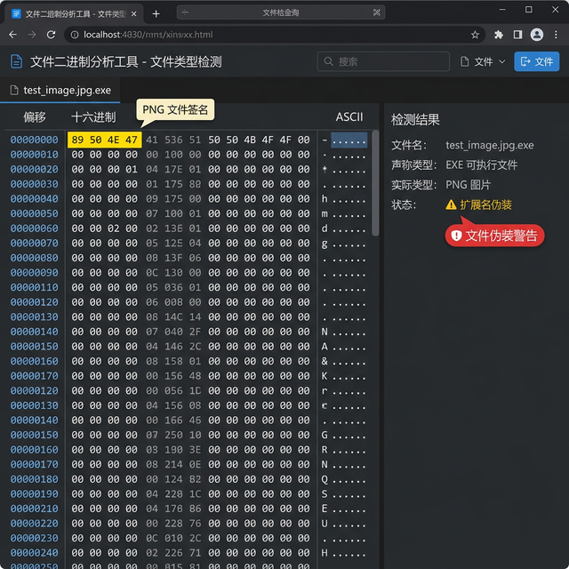

# 文件类型检测器

> 基于 Magic Bytes 签名的文件真实类型识别工具，有效防范扩展名伪装攻击

## 项目目的

文件上传是 Web 应用最常见的攻击面之一。攻击者可以将恶意可执行文件伪装为图片或文档格式绕过简单的扩展名检查。本工具通过解析文件头部的 Magic Bytes（魔术字节）来识别文件的真实类型，而非依赖扩展名判断，从根源上防止文件伪装攻击。

## 解决的痛点

- 仅依赖扩展名判断文件类型容易被绕过
- 现有检测工具缺乏批量处理能力
- 安全审计中缺少直观的文件二进制查看工具
- 未知文件类型缺少可扩展识别机制

## 功能展示

### 文件检测主界面

上传文件后自动解析 Magic Bytes，展示真实文件类型与扩展名一致性。


### 二进制 Hex 查看器

内置十六进制查看器，直接展示文件头部字节，高亮 Magic Bytes 签名区域，支持伪装文件告警。



### 批量文件检测

支持多文件批量上传检测，表格展示各文件检测结果，标注伪装文件。


### 检测统计面板

展示累计检测数据、文件类型分布、检测趋势等统计信息。


## 技术实现

| 模块 | 说明 |
|------|------|
| Magic Bytes 解析 | 读取文件头部 1-8 字节，匹配已知签名库 |
| 签名数据库 | 内置 200+ 种常见文件格式签名 |
| 扩展名对比 | 交叉检查声称类型与实际类型的一致性 |
| Hex 查看器 | 前端实现的文件二进制浏览器组件 |
| 批量处理 | 多文件并行分析，表格化展示结果 |

## 支持的文件格式

- **图片**：PNG, JPEG, GIF, BMP, WebP, TIFF, ICO, PSD
- **文档**：PDF, DOCX, XLSX, PPTX, ODF
- **压缩**：ZIP, RAR, 7Z, TAR, GZ
- **可执行**：EXE, DLL, ELF, Mach-O
- **音视频**：MP3, MP4, AVI, MKV, FLAC, WAV
- **其他**：SQLite, WASM, DEX 等

## 快速开始

```bash
git clone https://github.com/xiaofuqing13/FileTypeDetector.git
cd FileTypeDetector
pip install -r requirements.txt
python app.py
```

## 项目结构

```
FileTypeDetector/
├── app.py              # 主入口
├── detector/           # 检测核心
│   ├── magic.py        # Magic Bytes 匹配引擎
│   ├── signatures.py   # 签名数据库
│   └── analyzer.py     # 文件分析器
├── templates/          # 前端页面
└── docs/               # 文档截图
```

## 开源协议

MIT License
